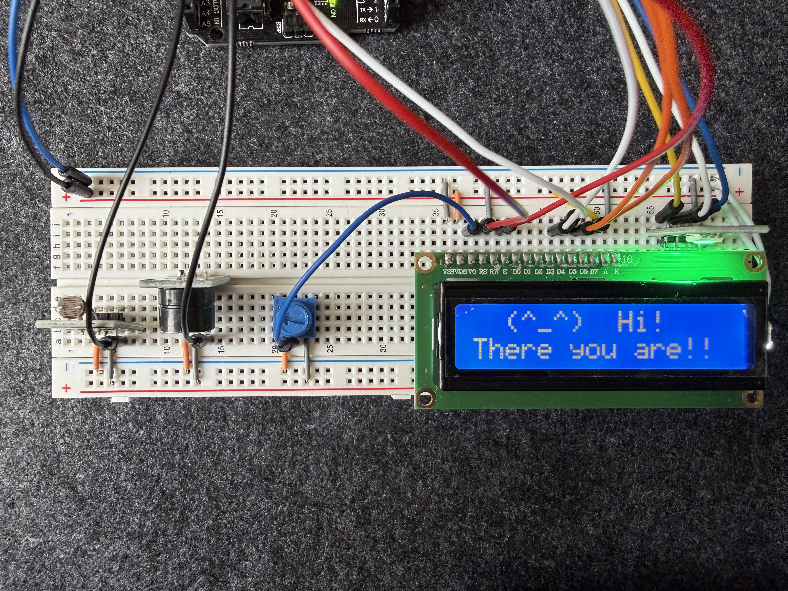
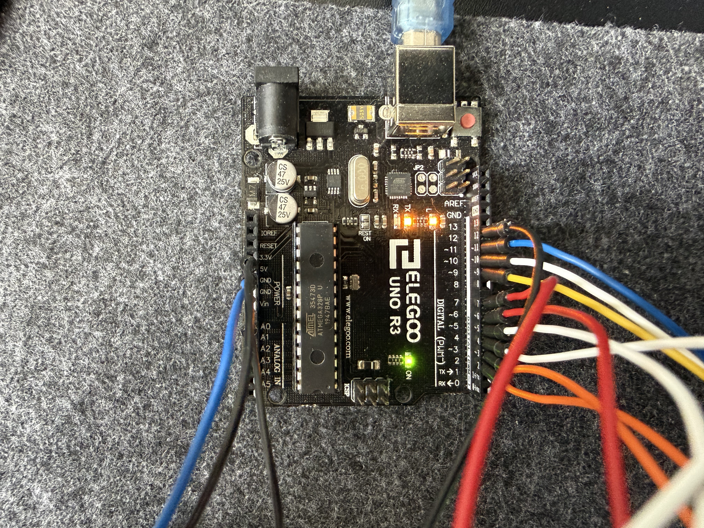

# Desk Gremlin

### What is this
Most microcontroller frameworks abstract away the hardware - Arduino's HAL lets you call ```digitalWrite() ``` without ever knowing what's happening underneath at the register level. I wanted to understand what's really going on - how each peripheral is configured, how it communicates, and what every bit in the register does. 

So I built the Desk Gremlin - a small interactive desk robot programmed entirely in bare-metal C on an ATmega328P, writing directly to the hardware registers instead of using the Arduino HAL. Every driver - UART, ADC, timer interrupts, I2C, and LCD - was written from scratch by reading the datasheet and implementing the protocol manually.

The result is a desk companion that reacts to its environment - it knows when the lights go out or blow up, changes its mood accordingly, and lets you know about it.

---

### Demo

[](https://youtube.com/shorts/Ad7pT2ayr2w)

---

### Architecture
Each driver in this project was written from scratch in bare-metal C, directly configuring the ATmega328P's hardware registers. No Arduino libraries, no HAL.

**UART** - configured at the register level (```UBRR0```, ```UCSR0B```, ```UDR0```) for serial communication. Used primarily for debugging - streaming sensor readings to the serial monitor to verify each driver before integrating it into the main loop.

**ADC** - reads the photoresistor by configuring the ATmega328P's onboard analog-to-digital converter directly. Converts analog voltage from the sensor into a digital value the program can reason about - driving the gremlin's light-based mood states.

**Timer Interrupts (CTC mode)** - instead of blocking the program with ```_delay_ms()``` calls, a hardware timer fires an interrupt every 100ms. This keeps the main loop non-blocking and responsive, a standard pattern in real embedded systems.

**I2C (TWI)** - a full two-wire serial driver written against the ATmega328P's TWI peripheral registers (```TWBR```, ```TWCR```, ```TWSR```, ```TWDR```). Used to communicate with a GY-521 IMU and DS1307 RTC - both currently in progress.

**LCD driver** - implements the HD44780 4-bit initialization sequence manually, including the three-nibble boot handshake required to switch the display from 8-bit to 4-bit mode. Handles character output, cursor positioning, and screen clearing.

---

### Hardware
|Component | Purpose |
|--------- |-------- |
| Arduino Uno (ATmega328P) | Main microcontroller |
| LCD1602A | Display - gremlin's face |
| Photoresistor | Light sensor - drives mood states |
| RGB LED | Mood color indicator |
| Active buzzer | Audio reactions |
| GY-521 IMU | Motion detection - in progress |
| DS1307 RTC | Time awareness - in progress |
| 10kΩ Potentiometer | LCD contrast adjustment

### Pin Connections
**LCD**
|Uno Pin | LCD Pin | Function |
|--------|---------|----------|
|D2| DB7 (pin 14) | Data bit 7|
|D3| DB6 (pin 13) | Data bit 6|
|D4| DB5 (pin 12) | Data bit 5|
|D5| DB4 (pin 11) | Data bit 4|
|D6| E (pin 6) | Enable|
|D7| RS (pin 4) | Register select|
|5V| VDD (pin 7) | Power |
|5V| A (pin 15) | Backlight +|
|GND| VSS (pin 1) | Ground |
|GND| RW (pin 5) | Read/Write (always write) |
|GND| K (pin 16) | Backlight -|
|Pot wiper | V0 (pin 3) | Contrast|

**Sensors and Peripherals**

|Uno Pin | Component | Function |
|--------|---------|----------|
|A0| Photoresistor | Light level (ADC)|
|A4| GY-521, DS1307 | I2C SDA |
|A5| GY-521, DS1307 | I2C SCL|
|D9| RGB LED (B) | Blue channel |
|D10| RGB LED (G) | Green channel |
|D11| RGB LED (R) | Red channel |
|D12| Active buzzer | Audio signal |

---

### What's next
- IMU integration (GY-521) - motion detection for desk slams, being picked up, and shaking
- RTC integration (DS1307) - time-of-day mood changes, sleepy at night, judgemental at 4am

---

### Images


The Arduino Uno pinouts and the breadboard

<br>
UART streaming for sensor readings

